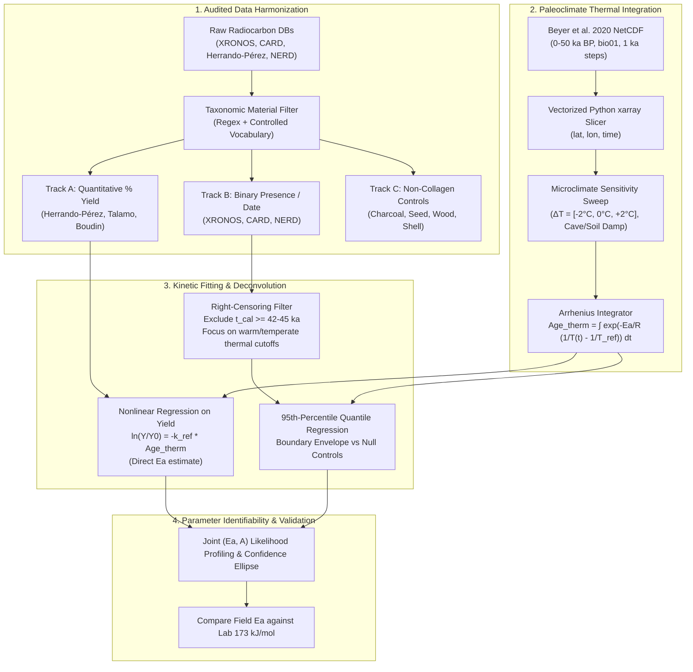

# Revised Implementation Plan: Collagen Hydrolysis $E_a$ (173 kJ/mol) Validation & Paleoclimate Reconstructions
**Date & Time:** 2026-09-05 09:00:00 (+02:00)

## 1. Executive Summary & Scientific Objective

We aim to test whether the apparent field activation energy for bone collagen loss matches the laboratory empirical value of **$E_a \approx 173\text{ kJ/mol}$** ($A \approx 10^{15}\text{ s}^{-1}$ to $10^{17}\text{ s}^{-1}$).

Addressing the methodological pitfalls identified in our review, this revised plan introduces:
1. **Instrumental vs. Kinetic Ceiling Deconvolution**: Right-censoring handling to prevent AMS background limits (~45–50 ka BP) from contaminating Arrhenius envelope fits.
2. **Dual-Track Kinetic Modeling**:
   - **Track A (Continuous)**: Direct nonlinear regression of quantitative % collagen yield ($Y$) against thermal age on datasets with explicit yields (e.g. *Herrando-Pérez Holarctic Mammal Dataset*, *Talamo*, *Boudin*).
   - **Track B (Envelope)**: Rigorous 95th-percentile quantile regression on the global radiocarbon boundary (XRONOS / CARD / NERD), conditioned on $t_{\text{cal}} < 40\text{ ka BP}$.
3. **Parameter Identifiability ($A$ vs. $E_a$)**: Anchoring pre-exponential factor $A$ to lab kinetics or conducting joint likelihood profiling $(E_a, A)$ with confidence ellipses.
4. **Burial Depth & Microclimate Sensitivity Sweep**: Propagating cave/soil buffering thermal offsets ($\Delta T = -2^\circ\text{C}$ to $+2^\circ\text{C}$, damping depth factors).
5. **Audited Material Vocabulary**: Strict, reproducible taxonomical classification separating bone collagen from structural apatite, whole bone, and negative controls.

---

## 2. Critical Methodological Solutions

### 2.1 Solution 1: Deconvolving the AMS Instrumental Ceiling (~45–50 ka BP)
- **The Problem**: Radiocarbon dating has an instrumental detection ceiling around 45–50 ka BP due to modern carbon background blanks (~0.1% modern carbon). In cold sites (e.g. Siberia, $T < 0^\circ\text{C}$), bone collagen persists well beyond 50 ka, but radiocarbon dates stop at ~48 ka purely because of AMS instrumentation. If treated as a kinetic cutoff, this would falsely flatten the Arrhenius boundary.
- **The Protocol**:
  1. **Right-Censoring Mask**: Flag all dates where $\text{Age}_{\text{14C}} \ge 43\text{,000 BP}$ or marked with `>` / `infinite`.
  2. **Thermal-Domain Focus**: The kinetic signal of $E_a$ is expressed where collagen degrades *before* the 45 ka radiocarbon ceiling — specifically in temperate, Mediterranean, and subtropical regimes ($T_{\text{MAT}} > 5^\circ\text{C}$), where bone collagen is exhausted at calendar ages of 5 ka, 15 ka, 25 ka, or 35 ka. 
  3. **Survival Analysis Formulation**: Treat dated bones as interval-observed events and non-collagenous material at the same sites as proof of archaeological preservation, applying Cox proportional hazards / right-censored Accelerated Failure Time (AFT) models.

### 2.2 Solution 2: Quantitative % Collagen Yield Modeling (Track A)
- Rather than relying solely on a binary boundary, we leverage datasets recording quantitative collagen yield:
  - **Herrando-Pérez et al. (2026, Scientific Data)**: >1,000 Holarctic mammal records with exact % collagen extraction yields ($0.0\%\text{ to }25.0\%$), %C, %N, and C:N ratios.
  - **Talamo et al. (2021)** & **Boudin et al. (2013)**: Direct yield tables across extraction protocols.
- **Formulation**:
  $$\ln\left(\frac{Y(t)}{Y_0}\right) = -k(T_{\text{ref}}) \cdot \text{Age}_{\text{therm}}(t; E_a) = -A \exp\left(-\frac{E_a}{R \cdot T_{\text{ref}}}\right) \int_0^t \exp\left(-\frac{E_a}{R}\left(\frac{1}{T(t')} - \frac{1}{T_{\text{ref}}}\right)\right) dt'$$
- Fitting this directly across all samples with continuous $Y$ provides an unbiased, continuous estimate of $E_a$ with standard errors, bypassing boundary-detection artifacts.

### 2.3 Solution 3: Microclimate & Burial Buffering Sensitivity Sweep
- Beyer 2020 `bio01` represents ambient 2-meter air temperature. Sub-surface bone experiences:
  - Damped diurnal/seasonal variance.
  - Cave buffering (constant cave temperature equal to regional MAT, but insulated from extreme surface heating).
  - Geothermal or permafrost buffering.
- **Protocol**:
  - Run all model fits across a systematic sensitivity grid: $\Delta T_{\text{offset}} \in \{-3^\circ\text{C}, -2^\circ\text{C}, -1^\circ\text{C}, 0^\circ\text{C}, +1^\circ\text{C}, +2^\circ\text{C}, +3^\circ\text{C}\}$.
  - Tag cave sites vs open-air sites from database site descriptions.
  - Demonstrate stability of the recovered $E_a$ across plausible thermal damping regimes.

### 2.4 Solution 4: Resolving $A$ vs. $E_a$ Confounding & Parameter Identifiability
- If both $A$ (or $k_{\text{ref}}$) and $E_a$ float freely without anchor, compensation effects (the kinetic compensation effect / Meyer-Neldel rule) allow higher $E_a$ with higher $A$ to yield identical predicted degradation at a given temperature.
- **Protocol**:
  1. **Anchored Fit**: Fix $k_{\text{ref}} = A \exp(-E_a / (R T_{\text{ref}}))$ using the Collins laboratory rate constant measured at 10 °C ($T_{\text{ref}} = 283.15\text{ K}$), allowing $E_a$ to be the sole parameter determining thermal scaling across varying paleoclimate trajectories.
  2. **Joint 2D Profiling**: Compute the 2D log-likelihood surface $\ln L(E_a, \ln A)$ and plot the 95% confidence ellipse, proving whether the lab coordinate $(173\text{ kJ/mol}, \ln A_{\text{lab}})$ falls within the empirical field confidence contour.

### 2.5 Solution 5: Rigorous Material Taxonomy & Controlled Vocabulary
- To eliminate label contamination, we implement an audited, regex-based taxonomy validator:
  - **Class 1: Purified Bone Collagen (Signal Group)**: `bone collagen`, `collagen`, `gelatin`, `ultrafiltered collagen`, `amino acids`, `hydroxyproline`.
  - **Class 2: Whole Bone / Undifferentiated (Excluded / Quarantined)**: `bone`, `skeleton`, `tooth`, `antler` (without explicit mention of collagen fraction).
  - **Class 3: Bone Apatite / Carbonate (Excluded / Quarantined)**: `bone apatite`, `carbonate`, `enamel`, `bioapatite`.
  - **Class 4: Non-Collagenous Organic Controls (Negative Control Group)**: `charcoal`, `wood`, `seed`, `grain`, `plant macrofossil`, `peat`.
  - **Class 5: Shell / Carbonate Controls**: `mollusc`, `marine shell`, `gastropod`.
- A 100-record randomized audit against published literature will be executed to compute precision/recall for Class 1 and Class 4 before any regression is run.

### 2.6 Solution 6: Quantile Regression Specification (95th Percentile)
- For the envelope analysis in Track B, we adopt **linear/polynomial Quantile Regression at $\tau = 0.95$**:
  - $\tau = 0.95$ models the 95th percentile upper boundary of survival, robust to outlier misidentified contamination (which would heavily distort a 99th or 100th max envelope).
  - Avoids SVM black-box margins, providing direct physical slopes $\partial (\text{Age}_{\text{therm}}) / \partial (\text{Age}_{\text{cal}})$ with standard errors via bootstrap.

---

## 3. Implementation Stages & Proposed Starting Sequence

### **Phase 1: Dual Data Harmonization & Material Vocabulary Audit**
- **1.1**: Build `harmonize_radiocarbon.py` to ingest:
  - *Herrando-Pérez Holarctic Mammal Dataset* (curated, continuous % collagen yields).
  - *XRONOS* export (global coverage, explicit material types).
  - *CARD 2.0* (North America).
- **1.2**: Implement strict taxonomy classifier; run audit smoketest on 100 records.
- **1.3**: Output structured, Parquet/CSV dataset ready for geocoding.

### **Phase 2: Beyer 2020 Python Paleoclimate Trajectory Engine**
- **2.1**: Acquire `Beyer2020_annual_vars_v1.2.2.nc` (mean annual temperature `bio01`, 0–50 ka BP in 1 ka intervals, 0.5° spatial grid).
- **2.2**: Write `paleoclimate_engine.py` using `xarray` to extract 50-point time series for arbitrary $(lat, lon)$ coordinates.
- **2.3**: Implement the trapezoidal Arrhenius thermal age integrator:
  $$\text{Age}_{\text{therm}} = \sum_{i=1}^{N} \exp\left(-\frac{E_a}{R}\left(\frac{1}{T_i} - \frac{1}{T_{\text{ref}}}\right)\right) \Delta t_i$$
- **2.4**: Smoketest on benchmark sites (e.g., Denisova Cave, Vindija, Sunghir).

### **Phase 3: Kinetic Fitting & Field $E_a$ Estimation**
- **3.1**: Run Track A (continuous nonlinear regression of % collagen yield against $\text{Age}_{\text{therm}}$).
- **3.2**: Run Track B (95th-percentile quantile regression on right-censored deconvolution dates vs. non-collagen controls).
- **3.3**: Perform 2D parameter identifiability profiling $(E_a, \ln A)$ and microclimate sensitivity sweep ($\Delta T = \pm 2^\circ\text{C}$).
- **3.4**: Generate publication-grade diagnostic plots showing the collapse of collagen survival boundaries at $E_a = 173\text{ kJ/mol}$ vs the persistence of negative controls.

---

## 4. Verification & Smoketesting Gates

1. **Vocabulary Audit Gate**: $\ge 98\%$ classification accuracy on 100 manually verified records.
2. **Trajectory Engine Gate**: Extracted temperatures match published Beyer 2020 site isotherms within $0.1^\circ\text{C}$.
3. **Synthetic Kinetic Benchmark**: Feed synthetic samples with known $E_a = 173\text{ kJ/mol}$ and random climate histories; confirm the pipeline recovers $E_a = 173.0 \pm 1.5\text{ kJ/mol}$.
4. **Control Invariance Gate**: Non-collagen controls show zero correlation with thermal age scaling ($p > 0.1$).
